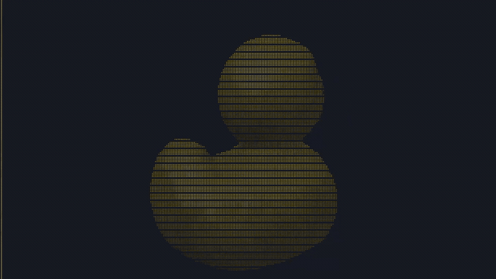
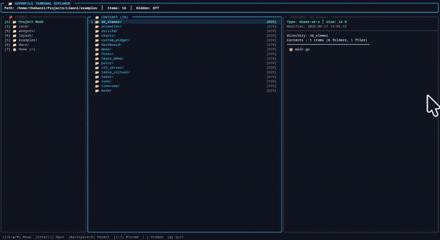
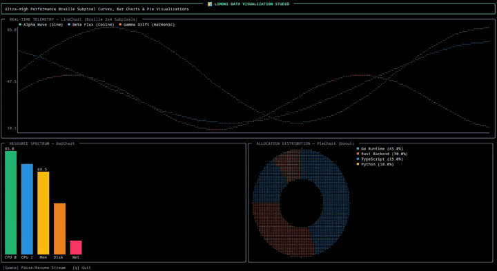

[](https://pkg.go.dev/github.com/thebanri/limoni)

<p align="center">
  
</p>

<h1 align="center">🍋 Limoni</h1>

<p align="center">
  <strong>An Ultra-Fast, Zero-Allocation, Thread-Safe Modern TUI Framework for Go.</strong>
</p>

<p align="center">
  <a href="https://github.com/thebanri/limoni/actions"></a>
  <a href="https://pkg.go.dev/github.com/thebanri/limoni"></a>
  <a href="https://golang.org"></a>
  <a href="LICENSE"></a>
  <a href="#-benchmarks"></a>
  <a href="AWESOME.md"></a>
  <a href="CODE_OF_CONDUCT.md"></a>
</p>

<p align="center">
  <strong>Language:</strong>
  <a href="README.md">English</a> •
  <a href="README_TR.md">Türkçe</a>
</p>

<p align="center">
  <a href="#-whats-new">What's New</a> •
  <a href="#-why-limoni">Why Limoni?</a> •
  <a href="#-showcase--demos">Showcase</a> •
  <a href="#-key-features">Key Features</a> •
  <a href="#-quick-start">Quick Start</a> •
  <a href="#-documentation">Documentation</a> •
  <a href="#-rich-widget-ecosystem">Widgets</a> •
  <a href="#-benchmarks">Benchmarks</a> •
  <a href="#-examples--showcase-applications">Examples</a> •
  <a href="#-awesome-limoni">Awesome Limoni</a>
</p>

---

## ⚡ Overview

**Limoni** is a modern, high-performance Terminal User Interface (TUI) engine for Go. Designed from the ground up for data-intensive dashboards, devtools, and responsive terminal applications, Limoni bridges the gap between Go's developer ergonomics and Rust-like raw rendering speed.

By utilizing a **flat 1D cell grid**, **zero-allocation hot-paths**, and an **optimized differential ANSI engine**, Limoni achieves ultra-smooth 60+ FPS rendering without triggering Go's Garbage Collector.

---

## 🆕 What's New & Recent Updates

* 🧱 **Composable Lego-Like Component Architecture (`component` package)**:
  Build rich, responsive interfaces declaratively using composable view trees (`limoni.VStack`, `limoni.HStack`, `limoni.Border`, `limoni.Pad`, `limoni.Center`, `limoni.Flex`, `limoni.FixedSize`). The underlying stack solver allocates zero heap memory on the hot rendering path while retaining full interoperability with monolithic widgets via `limoni.AsComponent`.
* 🔄 **Package Reorganization & Idiomatic Go Naming**:
  - `core/engine`: The Elm Architecture (TEA) application loop, message scheduling, cancellation precedence, and panic recovery (renamed from `core/runtime` to eliminate collisions with Go's standard library `runtime`).
  - `core/driver`: Cross-platform VT driver abstraction, raw mode termios, epoll/kqueue event loop, Windows VT, WebAssembly bridge, and SSH PTY streams (renamed from `core/backend` to clearly reflect responsibilities).
* 🛑 **Configurable Signal & Ctrl+C Handling**:
  Configure process termination behavior with `limoni.WithCatchCtrlC(bool)` and `limoni.WithoutDefaultQuitKeys()`, enabling applications to intercept Ctrl+C for modal confirmations, subshell escapes, or custom shutdown routines.
* ⚡ **Zero-Allocation Hot-Path Verification**:
  Continuous benchmark enforcement in CI ensuring `0 B/op` and `0 allocs/op` on buffer diffing, widget drawing, and component stack layout.
* 🧪 **Comprehensive Cross-Platform CI**:
  Full automated verification on Linux, macOS, and Windows with active data race detection (`-race`) across the entire codebase.

---

## 💡 Why Limoni?

| Feature / Goal | 🍋 Limoni (Go) | 🫧 Bubble Tea + Lipgloss (Go) | 🐀 Ratatui (Rust) |
| :--- | :--- | :--- | :--- |
| **Language & Tooling** | **Go (Native)** | Go (Native) | Rust (Native) |
| **Render Architecture** | **Flat 1D Grid + Adaptive ANSI Diff** | String concatenation / TEA | Immediate Mode Double Buffer |
| **Hot-Path Allocations**| **`0 B/op` (Zero Alloc)** | High heap allocation overhead | Stack / RAII |
| **Layout Paradigm** | **Declarative Flexbox & Stack Solver** | String slicing (`JoinHorizontal/Vertical`) | Constraint solver |
| **Mouse Interaction** | **Spatial Hit-Testing & Z-Index Routing** | None (manual coordinate math) | Manual coordinates |
| **Double Buffering & Diff** | **Sub-microsecond dirty-cell diff + Adaptive flush** | None (entire strings dumped to stdout) | Double-buffered diff |
| **Large Datasets / Tables**| **Virtual Paging (1M+ rows, 22 µs)** | High GC load on scroll | High layout cloning overhead |
| **3D & Vector Graphics**| **Built-in 3D (OBJ/STL/PLY) & Gouraud Shaders** | Third-party / custom | Addons required |
| **Accessibility (A11y)** | **Screen-reader & semantic tree built-in** | Limited / Manual | Experimental |
| **Concurrency Model**  | **Synchronized Model Lifecycle & Event Loops** | Single-threaded TEA loop | Manual thread coordination |

### 🍋 Limoni Composable (Lego UI) vs. 🎀 Charm Lipgloss

While **Lipgloss** popularized styling in Go, its string-concatenation architecture imposes structural limits on interactive, high-frequency applications:

| Capability | 🍋 Limoni Composable (`component`) | 🎀 Charm Lipgloss |
| :--- | :--- | :--- |
| **Data Primitive** | **16-byte cache-aligned `Cell` struct matrix** | Raw ANSI-escaped strings (`string`) |
| **Hot-Path Allocations** | **`0 B/op` (0 allocs/op)** on layout & render | High allocation rate (~100s of KBs to MBs/sec) |
| **Layout Model** | **True Flexbox & Grid constraint solver** | String slicing (`JoinHorizontal`, `JoinVertical`) |
| **Size Constraints** | **Proportional `Flex`, `Ratio`, `Min`, `Max`** | Fixed manual character widths only |
| **Mouse Hit-Testing** | **Automatic spatial bounds & z-index routing** | None (requires manual coordinate mapping) |
| **Screen Clipping** | **Sub-cell rectangular spatial clipping** | String chopping (causes broken ANSI codes) |
| **Z-Index & Overlays** | **Hardware-like layer stack & modal trapping** | Line-by-line string splicing (`PlaceOverlay`) |
| **Rendering Pipeline** | **Double-buffered ANSI diffing (`~7.1 µs`)** | Full terminal string dump (causes screen flicker) |
| **Migration Bridge** | **`compat/bubbletea` fluent style builder** | Native Charm ecosystem standard |

#### Why Zero-Allocation Architecture Matters:
1. **Eliminating Garbage Collector Stutter**: Lipgloss computes layouts by allocating intermediate heap strings for every border, padding byte, and horizontal slice. In animated 60 FPS applications, this generates massive heap churn that triggers periodic Go GC pauses (frame stutter). Limoni's component modifiers wrap children on the call stack and write directly into a reusable flat 1D buffer—generating **zero heap allocations (`0 B/op`)**.
2. **Native Interactivity & Hit-Testing**: Because Lipgloss outputs only a flat text string, it cannot determine which component received a mouse click. Limoni components automatically register their physical terminal boundaries (`cell.Rect`), dispatching click, hover, drag, and scroll events directly to callbacks with z-index ordering.

### Key Advantages:
1. **Zero GC Stutter**: Critical rendering loops generate zero heap allocations, eliminating random frame drops during heavy interactions or animations.
2. **True Multithreaded State**: Push state updates from any goroutine safely without bottlenecking the main event loop.
3. **Virtual Viewport Paging**: Render tables and lists with millions of rows without loading invisible cells into memory.
4. **Batteries-Included**: 3D Wireframe/Lambert/Gouraud rendering, rich markdown parser, physics/easing animations, fuzzy search, and command palettes out-of-the-box.

---

## 🎬 Showcase & Demos

### 🎮 3D Mesh & Vector Graphics Engine
Real-time 3D software rasterization running at 60+ FPS directly in terminal cells. Supports `.obj`, `.stl`, and `.ply` mesh models, depth-buffer Gouraud shading, Lambertian diffuse lighting, and interactive mouse/keyboard orbital controls.
<p align="center">
  
</p>

```bash
# Run locally (supports up to 240 FPS via -fps flag or [F] key):
go run ./examples/3d_viewer -fps 240

# Or run directly anywhere without cloning:
go run github.com/thebanri/limoni/examples/3d_viewer@latest -fps 240
```

---

### 📁 Superfile-Grade TreeView & Image Previews
Hierarchical collapsible file explorer widget (`widgets.TreeView`) with directory icons, tree guide lines, git/file status indicators, and live TrueColor half-block image previews.

<p align="center">
  
</p>

```bash
go run ./examples/treeview
```

---

### 📊 High-Resolution Charts & Data Visualization
Sub-pixel Braille curves (`widgets.LineChart`), vertical gradient spectrum bars (`widgets.BarChart`), and donut distributions (`widgets.PieChart`) rendering high-frequency streaming telemetry with zero heap allocations.

<p align="center">
  
</p>

```bash
go run ./examples/charts
```

---

## ✨ Key Features

* 🚀 **Ultra-Fast ANSI Diffing**: Computes dirty cell regions and emits minimal ANSI escape sequences in ~7.1 µs on full-screen changes (~140,000 FPS throughput) with zero heap allocations, short-circuiting in ~2 ns when clean.
* 📦 **Contiguous 1D Buffer**: Flat memory layout eliminates pointer chasing and maximizes CPU L1/L2 cache locality.
* 🎨 **TrueColor & Fallback Engine**: Full 24-bit RGB TrueColor support with automatic downsampling fallbacks for 256-color and 16-color terminals.
* 📐 **Responsive Flexbox Layouts**: Declarative layout engine supporting proportional splits, minimum/maximum size constraints, and nested alignments.
* 🎬 **Animation & Easing Engine**: Built-in interpolation for float, color, and transitions (Linear, Quad, Cubic, Elastic, Bounce).
* 🕶️ **Native 3D & Vector Graphics**: Render 3D `.obj`, `.stl`, `.ply` meshes directly in terminal cells with camera projection, rotation, and lighting!
* ♿ **Built-in Accessibility**: Accessible navigation tree, line-by-line inspection mode, and semantic annotations for screen-readers.

---

## 🚀 Quick Start

### Installation

```bash
go get github.com/thebanri/limoni
```

### 1. Composable Lego-Style UI Example (Zero Allocation)

```go
package main

import (
	"fmt"

	"github.com/thebanri/limoni"
	"github.com/thebanri/limoni/widgets"
)

func main() {
	err := limoni.Run(func(f *limoni.Frame, ev *limoni.Event) bool {
		if ev != nil && ev.Type == limoni.EventKey && ev.Key.Type == limoni.KeyEsc {
			return false // Exit
		}

		// Declarative layout composition with zero heap allocations on hot path:
		view := limoni.VStack(
			// Header (Fixed height 3 rows)
			limoni.FixedSize(0, 3, limoni.Border(
				limoni.Center(limoni.Label("🍋 Limoni Composable Architecture", limoni.Bold().WithFg(limoni.Hex("#00FFAA")))),
				widgets.SymbolsRounded,
				limoni.Fg(limoni.Hex("#00FFAA")),
			)),

			// Body (Flex 1): 2-Column Split
			limoni.Flex(1, limoni.HStack(
				limoni.Flex(1, limoni.Border(
					limoni.Label("Left Sidebar\n- Fast\n- Zero-Alloc\n- Thread-Safe", limoni.Fg(limoni.Hex("#FFCC00"))),
					widgets.SymbolsSingle,
					limoni.Fg(limoni.Hex("#FFCC00")),
				)),
				limoni.Flex(2, limoni.Border(
					limoni.Center(limoni.Label("Main Content Area\nPress ESC to exit.", limoni.Fg(limoni.Hex("#FFFFFF")))),
					widgets.SymbolsDouble,
					limoni.Fg(limoni.Hex("#3399FF")),
				)),
			)),

			// Footer (Fixed height 3 rows)
			limoni.FixedSize(0, 3, limoni.Border(
				limoni.Center(limoni.Label("ESC: Quit | 60+ FPS ANSI Diff", limoni.Fg(limoni.Hex("#888888")))),
				widgets.SymbolsSingle,
				limoni.Fg(limoni.Hex("#666666")),
			)),
		)

		f.RenderComponent(view, f.Area())
		return true
	})
	if err != nil {
		fmt.Printf("Error: %v\n", err)
	}
}
```

### 2. Interactive TEA (The Elm Architecture) Example

```go
package main

import (
	"context"
	"fmt"
	"os"

	"github.com/thebanri/limoni/core/cell"
	"github.com/thebanri/limoni/core/driver"
	"github.com/thebanri/limoni/core/engine"
	"github.com/thebanri/limoni/core/terminal"
	"github.com/thebanri/limoni/layout"
	"github.com/thebanri/limoni/widgets"
)

type AppModel struct {
	count int
}

func (m *AppModel) Init() []engine.Cmd {
	return nil
}

func (m *AppModel) Update(msg engine.Msg) engine.UpdateResult {
	switch msg := msg.(type) {
	case engine.KeyPressMsg:
		switch msg.Key.Type {
		case driver.KeyEsc:
			return engine.UpdateResult{Quit: true}
		case driver.KeyRune:
			switch msg.Key.Ch {
			case 'q', 'Q':
				return engine.UpdateResult{Quit: true}
			case '+', '=':
				m.count++
				return engine.UpdateResult{Redraw: true}
			case '-', '_':
				m.count--
				return engine.UpdateResult{Redraw: true}
			}
		}
	}
	return engine.UpdateResult{}
}

func (m *AppModel) View(frame *terminal.Frame) {
	area := frame.Area()

	// 3-Row Vertical Layout: Header, Counter, Footer
	chunks := layout.NewFlexLayout(layout.Vertical, 0,
		layout.Fixed(3),
		layout.Fill(),
		layout.Fixed(3),
	).Split(area)

	// Header
	frame.RenderWidget(widgets.Block{
		Title:       " 🍋 Limoni Counter Application ",
		BorderStyle: cell.Style{Fg: cell.NewColorRGB(0, 255, 200)},
	}, chunks[0])

	// Counter Body
	text := fmt.Sprintf("Current Counter Value: %d\n\nPress '+' to increment, '-' to decrement.", m.count)
	p := &widgets.Paragraph{
		Text:  text,
		Style: cell.Style{Fg: cell.NewColorRGB(0, 255, 200), Modifier: cell.ModifierBold},
	}
	frame.RenderWidget(p, chunks[1])

	// Footer
	frame.RenderWidget(widgets.Block{
		Title:       " [+] Increment  [-] Decrement  [Q/Esc] Quit ",
		BorderStyle: cell.Style{Fg: cell.NewColorRGB(100, 110, 120)},
	}, chunks[2])
}

func main() {
	d := driver.NewDriver(os.Stdin, os.Stdout)
	if err := d.Setup(); err != nil {
		fmt.Fprintf(os.Stderr, "Setup failed: %v\n", err)
		os.Exit(1)
	}
	defer d.Close()

	term, err := terminal.New(d)
	if err != nil {
		fmt.Fprintf(os.Stderr, "Terminal failed: %v\n", err)
		os.Exit(1)
	}

	app := engine.New(
		engine.WithModel(&AppModel{}),
		engine.WithFPS(60),
	)

	if err := app.RunTerminal(context.Background(), term, d); err != nil {
		panic(err)
	}
}
```

---

## 📚 Documentation

Detailed guides and API references are available in the [`docs/`](./docs) directory and on our [**Interactive Documentation Website**](https://limoni-docs.vercel.app/#quickstart):

| Guide | Description |
| :--- | :--- |
| **[⚡ Getting Started](./docs/getting-started.md)** | Step-by-step introduction, installation, and first interactive app. |
| **[🏛️ Architecture & Zero-Alloc Deep Dive](./docs/architecture.md)** | Memory layout, 1D contiguous grid, and cache locality. |
| **[⚙️ Core API Reference](./docs/core-api.md)** | `cell`, `buffer`, `terminal`, `backend`, and `runtime` packages. |
| **[📐 Flexbox Layout Engine](./docs/layout-guide.md)** | Multi-column, multi-row, percentage, ratio, and constraint layouts. |
| **[🧩 Widget Reference & Guide](./docs/widgets-reference.md)** | Full reference for all display, input, and modal widgets. |
| **[🎨 2D/3D Graphics & Canvas](./docs/graphics-and-canvas.md)** | Braille canvas, 3D Mesh loaders, Lambert/Gouraud shaders, and image protocols. |
| **[🎬 Animation & Physics](./docs/animation-and-physics.md)** | Interpolation, spring physics, and smooth easing curves. |
| **[♿ Accessibility & Theming](./docs/accessibility-and-theming.md)** | Screen-readers, High-Contrast mode, and `NO_COLOR` standard. |
| **[🌐 Drivers & WebAssembly](./docs/drivers-and-platforms.md)** | Cross-platform details: Linux, macOS, Windows VT100, WASM, and SSH. |
| **[📂 Examples Directory Guide](./docs/examples.md)** | Feature map and run instructions for all 12 example applications. |

---

## 🧩 Rich Widget Ecosystem

Limoni comes with an extensive suite of production-ready widgets:

| Category | Available Widgets |
| :--- | :--- |
| **Structure & Layout** | `Block`, `Dialog / Modal`, `Popup`, `ResponsiveGrid`, `Flexbox` |
| **Data Display** | `Table (Virtual/Paged)`, `List (Virtual)`, `Sparkline`, `ProgressBar`, `RichText` |
| **Input Controls** | `TextInput`, `TextArea`, `Checkbox`, `RadioGroup`, `Select / Dropdown`, `Slider` |
| **Navigation & Search**| `CommandPalette`, `FuzzySearch (FZF-style)`, `Tabs`, `KeybindingManager` |
| **Graphics & 3D** | `Canvas (Braille / Block)`, `Vector3D Mesh (OBJ/STL/PLY)`, `Lambertian & Gouraud Shaders`, `Image (Kitty/Sixel/iTerm2/HalfBlock)` |
| **Text & Docs** | `Markdown (Full GFM)`, `RichText Highlighting` |

---

## 🏛️ Architecture

```
                      ┌────────────────────────────────────────┐
                      │             User Application           │
                      └───────────────────┬────────────────────┘
                                          │ State & Views
                                          ▼
                      ┌────────────────────────────────────────┐
                      │    Composable UI / Declarative Widgets │
                      │   (VStack, Border, Pad, Tables, 3D)    │
                      └───────────────────┬────────────────────┘
                                          │ Draw to Grid
                                          ▼
                      ┌────────────────────────────────────────┐
                      │          Flat 1D Buffer Grid           │
                      │  [Zero Heap Allocation Cell Memory]   │
                      └───────────────────┬────────────────────┘
                                          │
                        ┌─────────────────┴─────────────────┐
                        ▼                                   ▼
             ┌─────────────────────┐             ┌─────────────────────┐
             │ Previous Frame Snap │             │ Current Frame Snap  │
             └──────────┬──────────┘             └──────────┬──────────┘
                        └─────────────────┬─────────────────┘
                                          │ Sub-microsecond Diff
                                          ▼
                      ┌────────────────────────────────────────┐
                      │       ANSI Diff & Optimize Stream      │
                      │  (Minimizes cursor jump & color reset) │
                      └───────────────────┬────────────────────┘
                                          │ Direct Write
                                          ▼
                      ┌────────────────────────────────────────┐
                      │   Terminal Driver (Unix/Win/WASM/SSH)  │
                      └────────────────────────────────────────┘
```

### 1. Zero-Allocation Rendering Pipeline
- **Contiguous 1D Flat Matrix:** Screen state is stored in a single flat slice of `[]cell.Cell` instead of jagged 2D slices, maximizing CPU L1/L2 cache locality.
- **Cache-Friendly 16-Byte Cell Alignment:** Every `cell.Cell` is exactly 16 bytes (`Content`: 4 bytes, `Style`: 12 bytes), fitting cleanly across 64-bit cache lines.
- **Stack-Allocated Context:** Rendering parameters and cascading styles are passed by value on the call stack via `cell.Context`, generating zero heap escape.
- **Pre-Allocated ANSI Diff Buffer:** `buffer.Diff` computes changes between double-buffered frame snapshots and writes minimal ANSI escape sequences into a reused byte slice (`writeBuf`), yielding **`0 B/op` and `0 allocs/op`** on hot rendering paths.

### 2. Decoupled, Non-Dogmatic Concurrency & TEA
- **Optional Elm Architecture (TEA):** Limoni includes a production-ready, typed Elm Architecture via `core/engine.Program` (`Model`, `Update`, `View`, `Cmd`, `Msg`) with redraw coalescing, background command worker pools, and panic recovery.
- **Non-Dogmatic Freedom:** Unlike frameworks that mandate TEA for every task, Limoni allows you to choose the paradigm that best fits your project:
  * **Composable Lego Trees:** Build declarative layouts with `limoni.VStack`, `limoni.HStack`, `limoni.Border`, and `limoni.Pad`.
  * **Immediate-Mode Callbacks:** Write quick scripts or simple tools using `limoni.Run(func(f, ev) bool)`.
  * **Multithreaded Goroutine Streaming:** Safely push background telemetry updates from arbitrary goroutines without bottlenecking the main loop.


---

## 📊 Benchmarks

Limoni includes a standardized cross-implementation benchmark suite measuring real dirty diffing, partial invalidations, virtual scrolling, and memory allocations under standard virtual terminal conditions (120×40 cells = 4,800 cells).

Run benchmarks locally:
```bash
# Run Buffer Diff benchmarks (measured dirty and clean passes)
go test ./core/buffer -run '^$' -bench . -benchmem

# Run Widget & Layout benchmarks
go test ./benchmarks -run '^$' -bench . -benchmem

# Generate HTML Comparison Dashboard
go run ./benchmarks/runners/dashboard -output benchmark-results/dashboard.html benchmark-results/limoni.json benchmark-results/bubbletea.json benchmark-results/ratatui.json
```

### Verified Benchmark Results (120×40 Viewport, AMD Ryzen / EPYC):

| Benchmark Operation | Measured Latency | Throughput | Allocations | Description |
| :--- | :--- | :--- | :--- | :--- |
| **`BenchmarkDiff_FullChanges`** | **`~90.1 µs`** | **~11,100 FPS** | **`0 B/op (0 allocs)`** | 100% full-screen cell mutation (4,800 cells) diffed against persistent double-buffer emitting ANSI escape stream |
| **`BenchmarkDiff_PartialChanges`** | **`~20.5 µs`** | **~48,800 FPS** | **`0 B/op (0 allocs)`** | 10% viewport mutation (480 cells across shifting rows) diffed against persistent double-buffer |
| **`BenchmarkDiff_NoChanges`** | **`~1.92 ns`** | **~520,000,000 FPS** | **`0 B/op (0 allocs)`** | Clean frame fast-path bypass when no buffer cells mutated |
| **`BenchmarkTextHeavyFrame`** | **`~60.8 µs`** | **~16,400 FPS** | **`5 B/op (0 allocs)`** | 40-line text dashboard rendering with unicode symbols and word wrapping across 120 columns |
| **`BenchmarkHundredLayers`** | **`~47.0 µs`** | **~21,200 FPS** | **`0 B/op (0 allocs)`** | 100 layered Block widgets evaluation and frame rendering (Ratatui hundred-layers parity) |
| **`BenchmarkTenThousandRowTable`** | **`~102 µs`** | **~9,800 FPS** | **`614 B/op`** | Active selection scrolling through a 10,000-row table rendering visible rows |
| **`BenchmarkOneMillionRowVirtualScroll`**| **`~2.53 ms`** | **~395 FPS** | **`4.9 KB/op (6 allocs)`** | Active virtual scrolling across 1,000,000 rows with viewport boundary pruning |
| **`BenchmarkMouseHitTest`** | **`~61.7 ns`** | **~16,200,000 ops/s**| **`0 B/op (0 allocs)`** | Hierarchical widget tree spatial hit testing across 100 click regions |
| **`BenchmarkAsyncUpdateBurst`** | **`~214 ns`** | **~4,660,000 msg/s** | **`8 B/op (0 allocs)`** | High-throughput Elm runtime async message dispatch |

> [!NOTE]
> **Transparency & Engineering Integrity Guarantee**:
> We do not use synthetic shortcuts, artificial buffer clears, or zero-offset static loops.
> - **Diff Benchmarks**: Run against a persistent double-buffer where cells genuinely mutate every single frame, forcing the full diff algorithm and ANSI encoder to run end-to-end.
> - **Scroll Benchmarks**: Actively cycle through rows (`Select((i * 7) % N)`), proving zero-overhead virtual window rendering under continuous scrolling.
> - **Hundred Layers**: Genuinely renders 100 overlapping `Block` widgets rather than a synthetic hit-test shortcut.

---

## 🖥️ Rendering Quirks & FAQ

### 1. Why do lines, 3D meshes, or images show hairline gaps in some terminals?
In standard terminal emulators, default monospace font line-height (cell padding) often adds 1–2px of empty vertical space between adjacent character rows. When rendering contiguous sub-pixel Braille matrices or half-blocks, this leading gap can cause surfaces to appear perforated ("grid gap" artifact).

#### How Limoni Solves This: The Lower Half-Block (`▄`) Baseline Standard
Traditional TUI frameworks frequently use the Upper Half Block (`▀`, `U+2580`). Because typography engines anchor font glyphs to the **baseline** (bottom of the character cell), any extra line-height creates an uncolored gap at the *top* of the cell, physically detaching `▀` from the row above it.

Limoni standardizes on the **Lower Half Block (`▄`, `U+2584`)**:
- **Upper Pixel:** Rendered via the cell background (`Cell.Bg`).
- **Lower Pixel:** Rendered via the cell foreground (`Cell.Fg`).
- **Glyph:** Set to `▄`.

Because background colors always stretch to fill 100% of the character cell, and `▄` rests directly on the baseline, half-block graphics connect seamlessly without inter-cell cracks even on terminals with loose vertical spacing.

### 2. Recommended Terminal Settings for Visual Perfection
To experience Limoni's 3D software rasterization, charts, and Braille vector graphics at maximum fidelity:

* **Set Line Height to 1.0:** In your terminal's configuration, ensure `line-height` / `cell-height` is set to `1.0` (or `100%` / 0px vertical line padding).
* **Recommended Modern Terminals:**
  - **[Ghostty](https://ghostty.org):** Native GPU renderer with pixel-perfect contiguous box-drawing, Braille, and block element rendering out-of-the-box.
  - **[Kitty](https://sw.kovidgoyal.net/kitty/):** Ultra-fast OpenGL engine with native graphics protocols (`kitty` protocol) and gapless glyph rendering.
  - **[WezTerm](https://wezfurlong.org/wezterm/):** Exceptional font fallback and contiguous box glyph handling.
  - **[Alacritty](https://alacritty.org):** Ensure `font.offset.y: 0` and standard line spacing in `alacritty.toml`.
* **Recommended Monospace Fonts:** [JetBrains Mono](https://www.jetbrains.com/lp/mono/), [Fira Code](https://github.com/tonsky/FiraCode), or any patched [Nerd Font](https://www.nerdfonts.com/).

### 3. How does Limoni maintain 60+ FPS during rapid full-screen animations?
Limoni features a threshold-based **Adaptive Flush Engine**:
* **Sparse Diffing (`dirtyRatio < 0.45`):** For typing, metric tickers, and cursor blinks, computes minimal dirty cell regions and emits precise cursor jumps (`CUP`), completing in **`~7.1 µs`** with zero heap allocations.
* **Full-Stream Redraw (`dirtyRatio >= 0.45`):** When rotating 3D meshes, scrolling large tables, or fading tabs, switching to jump diffing would produce thousands of disjoint escape sequences. Limoni automatically switches to synchronized home (`\x1b[H`) full-stream streaming wrapped in DEC synchronized update mode (`\x1b[?2026h`), completely eliminating visual tearing and flicker while preserving **`0 B/op`** zero-allocation efficiency.

---

## 📂 Examples & Showcase Applications

Explore runnable demo applications inside the [`examples/`](./examples) directory. See the full [**Examples Directory Guide (docs/examples.md)**](./docs/examples.md) for details on all available apps.

| Example | Description | Run Command |
| :--- | :--- | :--- |
| **[`3d_viewer`](./examples/3d_viewer)** | Professional 3D model viewer supporting `.obj`, `.stl`, `.ply`, texture mapping & Lambertian/Gouraud shaders. | `go run ./examples/3d_viewer` |
| **[`todo`](./examples/todo)** | Full-featured TEA Todo app with tags, priorities, filters, fuzzy search, and progress bars. | `go run ./examples/todo` |
| **[`dashboard`](./examples/dashboard)** | DevOps monitoring dashboard with CPU/Memory sparklines, live process table & streaming logs. | `go run ./examples/dashboard` |
| **[`table_virtual`](./examples/table_virtual)** | 1,000,000 row virtual table showcasing `0 B/op` zero-allocation 120 FPS streaming. | `go run ./examples/table_virtual` |
| **[`colors_and_styles`](./examples/colors_and_styles)** | 24-bit TrueColor gradients, 256-color ANSI palettes, text modifiers & A11y themes. | `go run ./examples/colors_and_styles` |
| **[`ssh_server`](./examples/ssh_server)** | Remote terminal server streaming interactive 60 FPS Limoni sessions over network/SSH sockets. | `go run ./examples/ssh_server` |
| **[`custom_widget`](./examples/custom_widget)** | Developer guide for implementing custom `widgets.Widget` components (Analog Meter / Gauge). | `go run ./examples/custom_widget` |
| **[`composable`](./examples/composable)** | Declarative Lego-style UI composition with `VStack`, `HStack`, `Border`, and zero-alloc flex solvers. | `go run ./examples/composable` |
| **[`simple`](./examples/simple)** | Minimal 50-line starting boilerplate with direct rendering and keyboard navigation. | `go run ./examples/simple` |
| **[`demo`](./examples/demo)** | **Interactive 3D Lemon Model (GLB/ASCII/Braille/Half-Block) & Feature Trailer.** | `go run ./examples/demo` |
| **[`showcase`](./examples/showcase)** | Full multi-tab suite with matrix rain, forms, 3D models, DevTools HUD (`F12`), and command palette. | `go run ./examples/showcase` |
| **[`wasm`](./examples/wasm)** | In-browser WebAssembly demo running on xterm.js. | `go run ./examples/wasm` |
| **[`animation`](./examples/animation)** | Physics-based animations, color transitions, and easing curves. | `go run ./examples/animation` |
| **[`forms`](./examples/forms)** | Text inputs, text areas, radios, checkboxes, and sliders. | `go run ./examples/forms` |
| **[`layer_demo`](./examples/layer_demo)** | Layered modals, popups, and focus isolation. | `go run ./examples/layer_demo` |

---

## 🌟 Awesome Limoni

Check out our curated list of real-world apps, tools, and third-party widgets in [**AWESOME.md**](./AWESOME.md).

> Built something cool with Limoni? Open a Pull Request and add your project to [AWESOME.md](./AWESOME.md)!

## 💡 Engineering Philosophy & Acknowledgements

Limoni was conceived to push the boundaries of terminal performance in Go, bringing Rust-grade latency and memory determinism to the Go ecosystem.

> [!NOTE]
> AI tools were used for generating initial boilerplates, documentation drafts, and test cases, while the core architecture, memory layout, and debugging were directed and implemented by the author.

### Transparency & Tooling
In the spirit of modern open-source transparency:
- **AI-Accelerated Scaffolding:** Modern AI developer tools (such as Claude and Gemini assistants) were utilized during development as high-velocity accelerators for generating boilerplate scaffolding, initial unit test cases, and draft documentation.
- **Human Systems Architecture:** The low-level systems engineering—specifically the flat 1D contiguous cell grid, cache-aligned 16-byte structs, sub-microsecond ANSI differential encoder, stack-allocated context pipeline, zero-allocation layout negotiation, and native Unix/Windows terminal drivers—was conceived, profiled, benchmarked, and directed by the author.

We believe that combining ambitious low-level systems engineering with modern development acceleration leads to more robust, performant, and well-tested software for the entire community.

---

## 🤝 Contributing

Contributions, issues, and feature requests are welcome!
Please make sure to review our [**Code of Conduct**](./CODE_OF_CONDUCT.md) before participating.

1. Fork the Project
2. Create your Feature Branch (`git checkout -b feature/AmazingFeature`)
3. Commit your Changes (`git commit -m 'Add some AmazingFeature'`)
4. Push to the Branch (`git push origin feature/AmazingFeature`)
5. Open a Pull Request

---

## 🛡️ Security Policy

Please read our [**Security Policy**](./SECURITY.md) to report vulnerabilities responsibly.

---

## 📜 Code of Conduct

This project adheres to the [**Contributor Covenant v2.1**](./CODE_OF_CONDUCT.md). By participating, you are expected to uphold this code.

---

## 📄 License

Distributed under the **Apache License 2.0**. See `LICENSE` for more information.

<p align="center">
  Made with 🍋 by <a href="https://github.com/thebanri">thebanri</a> and contributors.
</p>
