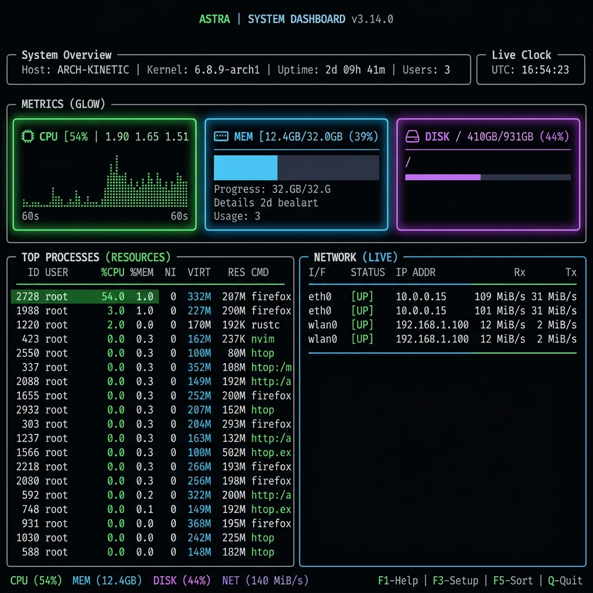

# 🍋 Limoni

**An Ultra-Fast, Zero-Allocation, Thread-Safe TUI Framework for Go.**

Limoni is a modern, state-of-the-art Terminal User Interface (TUI) library engineered for high-performance terminal rendering, sub-microsecond frame diffing, and completely lock-free async state updates.

---



---

## ✨ Core Features

*   🚀 **Sub-Microsecond Frame Diffing**: Optimized ANSI escape sequence encoding with a zero-loop fast path when no changes occur.
*   ⚡ **Flat Buffer Grid Architecture**: Minimizes cache misses and pointer chase overheads by aligning cell buffers inside a contiguous 1D array.
*   💎 **Zero Heap Allocations**: Reuses buffers, caches style reset transitions, and formats integer coordinates without a single garbage collector invocation.
*   🔒 **Lock-Free Async Rendering**: Safe message queues with double-buffering support, allowing frame rendering and state updates to run on separate threads.
*   📐 **Declarative Layouts & Flexbox**: Clean layout system built for responsive widgets, tables, lists, and canvas drawing.

---

## ⚖️ Comparison: Limoni vs. Bubble Tea vs. Ratatui

Here is a high-level, general comparison of how Limoni fits alongside other popular TUI libraries:

| Dimension | 🍋 Limoni (Go) | 🫧 Bubble Tea (Go) | 🐀 Ratatui (Rust) |
| :--- | :--- | :--- | :--- |
| **Language** | Go (Native) | Go (Native) | Rust (Native) |
| **Architecture** | Flat 1D Buffer + Async Queues | The Elm Architecture (TEA) | Immediate Mode Rendering |
| **Memory Model** | **Zero-Allocation Hot-Path** | High garbage collection overhead | Stack-heavy, safe memory |
| **Async Updates** | Built-in thread-safe buffer swaps | Single-threaded message loop | Manual thread coordination |
| **Large Data (Tables)** | Sub-microsecond paging & virtual rows | Allocates on scroll / row retrieval | High layout and cloning overhead |
| **Terminal I/O** | Double-buffered diffing (ANSI-only) | Full screen redraws | Double-buffered diffing |

### Why choose Limoni?
1.  **If you write Go**: You get Rust-like rendering performance (sub-microsecond) without the garbage collector pauses or stack tracing allocations of Bubble Tea.
2.  **If you do Async Tasks**: Unlike Bubble Tea's Elm Architecture which funnels all updates through a single loop, Limoni lets you push async updates in the background safely.
3.  **If you handle massive datasets**: Limoni's virtual viewport caching avoids fetching rows that aren't on the screen, scaling effortlessly to millions of rows.

---

## 🚀 Quick Start

Here is a minimal example demonstrating how to initialize a buffer, write stylized content, and diff it:

```go
package main

import (
	"fmt"
	"os"

	"github.com/thebanri/limoni/core/buffer"
	"github.com/thebanri/limoni/core/cell"
)

func main() {
	// Initialize a 120x40 frame buffer
	area := cell.NewRect(0, 0, 120, 40)
	front := buffer.NewBuffer(area)
	back := buffer.NewBuffer(area)

	// Set cell content with custom TrueColor styling
	front.SetCell(0, 0, cell.Cell{
		Content: '🍋',
		Style: cell.Style{
			Fg: cell.NewColorRGB(255, 223, 0), // Yellow Fg
			Bg: cell.NewColorRGB(30, 30, 30),   // Dark Grey Bg
		},
	})

	// Diff buffers and generate optimal ANSI escape bytes
	var writeBuf []byte
	writeBuf, _ = buffer.Diff(front, back, writeBuf[:0], true, true)

	// Write directly to stdout
	os.Stdout.Write(writeBuf)
}
```

---

## 📊 Standardised Workload Dashboards

Limoni includes a robust, cross-implementation benchmarking framework that compares Go runners with Rust runners under exactly identical workloads. 

To view the comparative metrics dashboard:
1.  Run the benchmarks: `go run ./benchmarks/runners/limoni`
2.  Generate the comparison dashboard: `go run ./benchmarks/runners/dashboard`
3.  Open the compiled HTML page: `benchmark-results/dashboard.html`

---

## 🛡️ License

Limoni is open-source and released under the MIT License.
