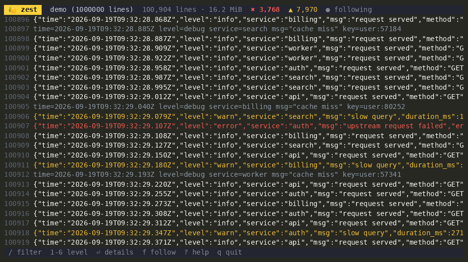
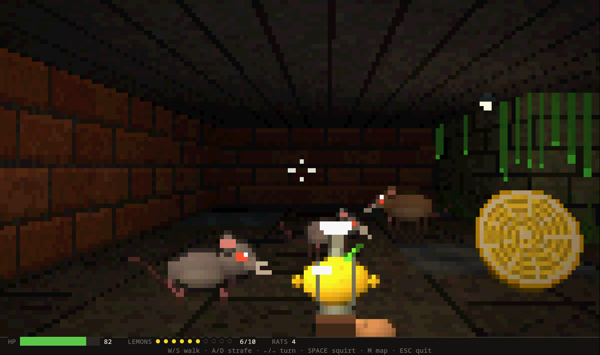

<p align="center">
  
</p>

<h1 align="center">🍋 Limoni</h1>

<p align="center">
  <strong>Go için bir terminal arayüz motoru: testler tıklayabilir, AI agent'lar kullanabilir,<br>garbage collector ise hiç görmez.</strong>
</p>

<p align="center">
  <a href="https://github.com/thebanri/limoni/actions"></a>
  <a href="https://pkg.go.dev/github.com/thebanri/limoni"></a>
  <a href="https://golang.org"></a>
  <a href="LICENSE"></a>
  <a href="docs/tr/benchmarks.md"></a>
</p>

<p align="center">
  <a href="README.md">English</a> • <a href="README_TR.md">Türkçe</a>
</p>

<p align="center">
  <strong><a href="https://thebanri.github.io/limoni/">▶ Tarayıcıda dene</a></strong> — aynı motor WebAssembly'ye derlenmiş hâlde çalışıyor, kurulum gerekmiyor.
</p>

<p align="center">
  
</p>

---

## Hızlı başlangıç

```bash
go get github.com/thebanri/limoni
```

```go
package main

import "github.com/thebanri/limoni"

func main() {
	limoni.Run(func(f *limoni.Frame, ev *limoni.Event) bool {
		if ev != nil && ev.Type == limoni.EventKey && ev.Key.Type == limoni.KeyEsc {
			return false // çıkış
		}
		f.RenderComponent(limoni.Border(
			limoni.Center(limoni.Label("Limoni'den merhaba 🍋  (Esc ile çık)", limoni.Bold())),
			limoni.SymbolsRounded,
			limoni.Fg(limoni.Hex("#FFCC00")),
		), f.Area())
		return true
	})
}
```

Hemen çalışan ve testi hazır yazılmış bir proje de oluşturabilirsin:

```bash
go run github.com/thebanri/limoni/cmd/limoni@latest new uygulamam    # -template counter|dashboard|form|ssh
cd uygulamam && go mod tidy && go run .
go test ./...                                                         # her şablon bir uitest testiyle gelir
```

**Sonraki adımlar:** [Başlangıç rehberi](docs/tr/getting-started.md) · [Widget galerisi](docs/widget-gallery.md) · [Örnekler](#örnekler)

---

## Neden Limoni

### 1. Arayüzün bir semantik ağacı var: testler ve agent'lar widget'lara adıyla ulaşır

[termwright](https://github.com/fcoury/termwright) ve
[mcp-tui-test](https://github.com/GeorgePearse/mcp-tui-test) gibi terminal otomasyon
araçlarının çoğu ekrandaki karakter ızgarasını okur. Bu yüzden düzen bir sütun
kaydığında test bozulur. Limoni uygulaması ise her karede bir semantik ağaç kurar
(ekran okuyucunun kullandığı ağacın aynısı). Aşağıdaki araçlar ızgara yerine bu
ağaç üzerinde çalışır.

**`uitest`: Playwright tarzı testler.** Kontroller `sleep` yerine bekler. Bir test
başarısız olursa son karenin ağacının tamamını yazdırır.

```go
page := uitest.Run(t, 80, 24, app.draw)            // süreç içinde: terminal gerekmez

page.GetByRole("input", "New task").Type("Tag v1.0")
page.GetByRole("button", "Add task").Click()
page.Expect(page.GetByRole("list-item", "").Within(page.GetByRole("list", "Tasks"))).ToHaveCount(3)
page.Expect(page.GetByID("status")).ToContainLabel("Added")
```

**`limoni-mcp`: uygulamayı bir AI agent'a kullandır.** Claude Code, Cursor veya
herhangi bir MCP istemcisine aynı ağaç üzerinde çalışan sekiz araç verir (`tree`,
`click`, `type_text`, `wait_for`…). Kayda alınmış bir denemede Claude Code, bir sürüm
kontrol listesini 17 araç çağrısında tamamladı. Buna, agent'ın geri okuyamadığı bir
deploy token'ını yazmak da dahildi.

```bash
go run -tags limoni_debug ./examples/agent_checklist
claude mcp add limoni -- limoni-mcp -socket "$XDG_RUNTIME_DIR/limoni-checklist.sock"
```

Otomasyon soketi yalnızca `-tags limoni_debug` ile yapılan derlemelerde var.
Varsayılan olarak kapalıdır, yalnızca aynı kullanıcı bağlanabilir ve gizli alanlar
hiçbir zaman dışarı verilmez.
→ [Semantik otomasyon, MCP ve uitest](docs/tr/automation.md)

### 2. Hissedilen yerde hızlı

- **Kare başına sıfır heap tahsisatı.** Render motoru, tüm widget'ların çizimi ve yaygın girdi widget'larının tıklama işlemesi bunun kapsamında ve CI'da zorunlu tutuluyor, böylece animasyonlar GC duraklamalarıyla takılmaz. Sürükleme veya özel işleyici kullanan widget'lar (Table, Slider, Dialog, …) hâlâ her biri için bir closure tahsis ediyor. [Ayrıntılar](docs/architecture.md#5-allocation-free-interactive-frames).
- **Kare başına az bayt.** Boş diziler `ECH`/`EL`, tekrarlar `REP` olarak gönderilir. Tam ekran yenileme **377 bayt** tutar, boşta bekleyen bir uygulama ise **hiç bayt göndermez**. SSH üzerinde hissettiğin şey CPU değil, gönderilen bayttır.
- **Sanal tablo ve listeler.** Yalnızca görünen satırlar işlendiği için bir milyon satır kare başına ~2,7 ms'de kayar.

| Ryzen 5 5600, Go 1.27.1 üzerinde ölçüldü | Gecikme | Tahsisat |
| :--- | ---: | ---: |
| Tam ekran diff, 120×40, her hücre değişmiş | ~50 µs | 0 |
| Ekranın %10'u değişmiş | ~24 µs | 0 |
| Hiçbir şey değişmemiş | ~2 ns | 0 |
| Üst üste 100 blok, çizim ve diff | ~68 µs | 0 |

Mutlak değerler makineye bağlıdır. Ratatui 0.30.2, Ultraviolet ve Bubble Tea v1.3.10
ile karşılaştırmalar, hangi oranların *anlamlı olmadığı* da dahil olmak üzere,
[docs/tr/benchmarks.md](docs/tr/benchmarks.md) ve
[metodoloji](docs/benchmark-methodology.md) belgelerinde. Önceki bir ölçüm 4.700 kat
üstünlük göstermişti. Bu, benchmark düzeneğindeki bir hatadan kaynaklanıyordu;
[metodoloji](docs/benchmark-methodology.md#the-4700-that-was-a-harness-bug) belgesi
hatanın nasıl yakalandığını anlatıyor.

### 3. Diğer TUI kütüphanelerinin sana bıraktığı parçalar hazır

| | |
| :--- | :--- |
| 🕶️ **3D** | OBJ/STL/PLY/GLB için Lambert ve Gouraud gölgelendirmeli, terminal hücrelerine çizen yazılımsal rasterleştirici |
| 🖼️ **Görseller** | Kitty, Sixel, iTerm2 ve yarım blok (half-block) yedeği |
| 📊 **Grafikler** | Braille çizgi grafik, çubuk grafik, pasta grafik, sparkline |
| 📝 **Markdown** | Kaydırılabilir okuyuculu GFM çizimi |
| ♿ **Erişilebilirlik** | Semantik ağaç, ekran okuyucu satır modu, `NO_COLOR`, yüksek kontrast, azaltılmış hareket |
| 🧬 **Unicode** | UAX #29 grapheme cluster'ları (Unicode 17.0, 766 uygunluk testinin tamamı geçiyor), böylece bayraklar ve aile emojileri tek hücre kaplar |
| 🔗 **Köprüler** | OSC 8 bağlantıları, markdown içinde ya da herhangi bir stilde — terminal gösteremiyorsa adres metin olarak yazılır |
| 📃 **Inline mod** | `gum` gibi normal ekranın bir bandında çizer, terminal geçmişi (scrollback) korunur |
| ⏺️ **Oturum tekrarı** | Bir oturumu kaydet, regresyon testi olarak tekrar oynat ([doküman](docs/tr/session-recording.md)) |
| 🌐 **Her yerde** | Linux, macOS, BSD, Windows, tarayıcıda WebAssembly, SSH oturumları |

Yalnızca iki bağımlılık var: `golang.org/x/sys` ve `golang.org/x/crypto`.

<table>
  <tr>
    <td></td>
    <td></td>
  </tr>
  <tr>
    <td align="center"><code>go run ./examples/treeview</code></td>
    <td align="center"><code>go run ./examples/charts</code></td>
  </tr>
</table>

### Limoni sana uygun mu?

**Limoni'yi seç**, eğer Go ile bir terminal uygulaması yazıyorsan ve bunlardan biri önemliyse:

- **Arayüzü test etmek ya da bir yapay zeka agent'ına kullandırmak istiyorsan**,
  ekran koordinatlarıyla değil widget rolü ve etiketiyle (`uitest`, `limoni-mcp`).
- **Sık yeniden çiziyorsa**: dashboard'lar, log görüntüleyiciler, izleme araçları,
  oyunlar, animasyon, SSH üzerinden çalışan her şey. Çizim yolu çöp üretmez ve az bayt gönderir.
- **Diğer kütüphanelerin sana bıraktığı şeylere ihtiyacı varsa**: 3D modeller, görseller,
  grafikler, markdown, bir milyon satırlık tablo, ekran okuyucu desteği, tarayıcıda WebAssembly.
- **İki stili tek kütüphanede istiyorsan**: dashboard'lar için immediate mode
  (`limoni.Run`), formlar ve sihirbazlar için Elm mimarisi (`limoni.RunProgram`).
- **Küçük bir bağımlılık ağacı istiyorsan**: `golang.org/x/sys` ve `golang.org/x/crypto`.

**Başka bir şey seç**, eğer:

- Bugün **kararlı bir 1.0 API**'ye ihtiyacın varsa. Limoni henüz 1.0 öncesinde ([Durum](#durum)).
- **Charm ekosistemine** (Bubbles, Huh, Glamour, Wish) ve topluluğuna dayanıyorsan.
  Bubble Tea daha büyük ve daha eski bir proje. Elinde bir Bubble Tea uygulaması varsa
  `compat/bubbletea` modellerini Limoni üzerinde çalıştırır
  ([geçiş rehberi](docs/bubbletea-migration.md), İngilizce); yeniden yazmadan deneyebilirsin.
- **Rust** yazıyorsan: Ratatui kullan.
- Uygulama **tek seferlik bir soruysa** (tek bir soru, bir spinner): küçük bir prompt
  kütüphanesini öğrenmek daha az iş.

Bubble Tea v1/v2 ve Ratatui 0.30 ile özellik özellik karşılaştırma:
[docs/tr/comparison.md](docs/tr/comparison.md).

---

## Limoni ile yapıldı: zest

<p align="center"></p>

[**zest**](cmd/zest) bir log görüntüleyici ve Limoni'nin amiral gemisi uygulaması. Dosyaları ve pipe'ları
takip eder, satırları seviyeye göre renklendirir ve bir milyon satırı donmadan filtreler. 67 MiB'lık,
1.000.000 satırlık bir log yaklaşık yarım saniyede ekrana gelir.

```bash
go install github.com/thebanri/limoni/cmd/zest@latest
zest -demo 1000000        # ya da: zest app.log, kubectl logs -f pod | zest
```

Ya da [tarayıcıda dene](https://thebanri.github.io/limoni/): "Logs · zest" sekmesi.

### Bir de oyun: Lemon Hunt

<p align="center"></p>

[**Lemon Hunt**](apps/lemonhunt) kısa bir birinci şahıs oyunu. Fareleri limon suyuyla vur, kanalizasyonda on limon bul;
sonra inin kapısı açılır ve karşına farelerin kralı Ratatui çıkar: tacı, can barı ve fırlatacak peyniri var.

```bash
go install github.com/thebanri/limoni/apps/lemonhunt@latest
lemonhunt
```

Ya da [tarayıcıda oyna](https://thebanri.github.io/limoni/?app=lemonhunt), sesiyle birlikte.

Yarım bloklarla hücre başına iki piksel çizen bir raycaster: ışıklı dokular, piksel sanatı fareler, piksel piksel
ışın izlenen 3D yarım limonlar ve açılışta sentezlenen sesler. Bir kare, diff dahil hiç bellek ayırmaz. Tuşları
`WithKeyReleases` ile basılı tutar; kitty, Ghostty ve WezTerm'de yürüyüş akıcıdır. Her oyun isabet ve süreye
göre puanlanır; skor tablosu bir dosyada ya da tarayıcının deposunda saklanır.

---

## Uygulama yazmanın iki yolu

| | Immediate mode | Bildirimsel (Elm mimarisi) |
| :--- | :--- | :--- |
| **Giriş noktası** | `limoni.Run(func(f, ev) bool)` | `limoni.RunProgram(ctx, model)` |
| **Durum nerede** | senin closure'ında | `Init` / `Update` / `View` içeren bir `limoni.Model`'de |
| **Uygun olduğu işler** | dashboard, 3D, oyun, animasyon | form, sihirbaz, CRUD aracı, asenkron işler |
| **Çalışma zamanı ne sağlar** | her olayda yeniden çizim | komutlar, iptal, deterministik sıralama, panic kurtarma, oturum kaydı |

İkisi de aynı render motorunu ve widget'ları kullanır ve kök paketten erişilebilir.
[`examples/counter`](examples/counter), 80 satırın altında eksiksiz bir bildirimsel
uygulama. Bubble Tea'den mi geliyorsun? [Geçiş rehberine](docs/bubbletea-migration.md)
bak.

---

## Widget'lar

| Kategori | Widget'lar |
| :--- | :--- |
| **Düzen** | `VStack` / `HStack` / `ZStack`, `Flex`, `Border`, ızgara düzeni (`layout.GridLayout`), `Block` (kenarlık birleştirmeli), `SplitPane` (sürüklenebilir), `Viewport`, `Dialog`, `Popup`, `StatusBar` |
| **Veri** | `Table` (sanal), `List` (sanal), `TreeView`, `FilePicker`, `Calendar`, `Sparkline`, `ProgressBar`, `Gauge`, `LineGauge`, `RichText` |
| **Grafikler** | `LineChart`, `BarChart`, `PieChart` — Braille, sekstant ya da kadran marker'ları |
| **Girdi** | `TextInput`, `Autocomplete`, `TextArea`, `Checkbox`, `RadioGroup`, `Select`, `Slider`, `ColorPicker` |
| **Gezinme** | `Tabs`, `Scrollbar`, `CommandPalette`, bulanık arama (fuzzy search), tuş bağlama yöneticisi |
| **Geri bildirim** | `Spinner`, `Toast`, masaüstü bildirimleri (OSC 9 / OSC 99) |
| **Grafik** | `Canvas` (Braille, sekstant, kadran, blok), noktalarla ya da kitty/iTerm2/Sixel üzerinden resim olarak 3D modeller, `Image` |
| **Metin** | `Markdown`, `CodeView` (sözdizimi renklendirme), `BigText`, `Label`, `Paragraph` |
| **Araçlar** | `DevTools` paneli (`F12`), temalar, doğrulama |

→ [Widget galerisi](docs/widget-gallery.md) · [Widget referansı](docs/tr/widgets-reference.md)

---

## Örnekler

| Örnek | Ne gösteriyor |
| :--- | :--- |
| [`demo`](examples/demo) | Tanıtım demosu: ASCII, Braille ve yarım blokla çizilmiş 3D bir limon |
| [`xray`](examples/xray) | Röntgen altında bir gece şehri: diff'in gönderdiği her hücre parlar, ölçülen baytlar tam yeniden çizimle karşılaştırılır (kayıt için `-film`) |
| [`showcase`](examples/showcase) | Sekmeler, formlar, matrix yağmuru, 3D, komut paleti, DevTools (`F12`) |
| [`3d_viewer`](examples/3d_viewer) | Gölgelendirme ve yörünge kontrollü OBJ/STL/PLY görüntüleyici (`-fps 240`) |
| [`dashboard`](examples/dashboard) | Canlı CPU ve bellek sparkline'ları, süreç tablosu, akan loglar |
| [`table_virtual`](examples/table_virtual) | Bir milyon satırlık tablo |
| [`agent_checklist`](examples/agent_checklist) | Bir AI agent'ın kullanması için yazılmış ve `uitest` ile test edilen uygulama |
| [`todo`](examples/todo) | Etiketli, filtreli ve bulanık aramalı bildirimsel todo uygulaması |
| [`counter`](examples/counter) | En küçük bildirimsel uygulama |
| [`composable`](examples/composable) | `VStack`, `HStack`, `Border`, `Flex` ile düzen kurma |
| [`forms`](examples/forms) · [`layer_demo`](examples/layer_demo) · [`treeview`](examples/treeview) · [`charts`](examples/charts) | Girdiler, modallar, dosya ağacı, grafikler |
| [`ssh_server`](examples/ssh_server) · [`wasm`](examples/wasm) | SSH üzerinden sunma, tarayıcıda çalıştırma |

Herhangi birini `go run ./examples/<ad>` ile çalıştırabilirsin. Repoyu klonlamadan:
`go run github.com/thebanri/limoni/examples/3d_viewer@latest`.
Tüm örnekler: [docs/tr/examples.md](docs/tr/examples.md).

---

## Dokümantasyon

| | |
| :--- | :--- |
| [Başlangıç](docs/tr/getting-started.md) | Kurulum, ilk uygulama, iki uygulama modeli |
| [Mimari](docs/tr/architecture.md) | Düz hücre ızgarası, diff ve çizim yolunun neden bellek tahsis etmediği |
| [Düzen](docs/tr/layout-guide.md) · [Widget'lar](docs/tr/widgets-reference.md) · [Çekirdek API](docs/tr/core-api.md) | Referans |
| [Semantik otomasyon](docs/tr/automation.md) | Otomasyon soketi, `limoni-mcp`, `uitest` ve güvenlik modeli |
| [Oturum kaydı](docs/tr/session-recording.md) | Oturumları kaydedip regresyon testi olarak oynatma |
| [Grafik](docs/tr/graphics-and-canvas.md) · [Animasyon](docs/animation-and-physics.md) · [Erişilebilirlik](docs/accessibility-and-theming.md) | Özellik rehberleri |
| [Sürücüler ve platformlar](docs/drivers-and-platforms.md) | Unix, Windows, WebAssembly, SSH |
| [Karşılaştırma](docs/tr/comparison.md) | Bubble Tea v1/v2, Lip Gloss ve Ratatui ile, çekinceleriyle birlikte |
| [Benchmark'lar](docs/tr/benchmarks.md) | Ölçülen tüm sayılar ve nasıl yeniden üretileceği |
| [Görsel SSS](docs/tr/faq.md) | İnce boşluklar, önerilen terminaller, emoji |
| [Kararlılık](docs/tr/stability.md) · [Değişiklik günlüğü](CHANGELOG.md) | 1.0'dan önce neler değişebilir |

Türkçe dokümanların tamamı: [docs/tr](docs/tr/README.md).

---

## Durum

Limoni henüz **1.0 öncesi**. Yama sürümleri API'yi bozmaz. Minor sürümler bozabilir;
her kırılma [değişiklik günlüğünde](CHANGELOG.md) listelenir. Çekirdek render motoru,
düzen sistemi ve widget'lar oturmak üzere. Otomasyon, `uitest` ve oturum paketleri
ise yeni ve deneysel. v1.0'dan önce nelerin tamamlanması gerektiği
[docs/tr/stability.md](docs/tr/stability.md) sayfasında.

## Topluluk ve katkı

- **Sorular ve fikirler:** [GitHub Discussions](https://github.com/thebanri/limoni/discussions)
- **Hatalar:** [issue aç](https://github.com/thebanri/limoni/issues/new/choose). Şablon terminal emülatörünü soruyor, çünkü görsel hataların çoğu ona bağlı.
- **İlk katkı:** [`good first issue`](https://github.com/thebanri/limoni/labels/good%20first%20issue) etiketli issue'lar tek bir dosyayla sınırlı ve değişikliğin nasıl doğrulanacağını anlatıyor. [CONTRIBUTING.md](CONTRIBUTING.md) ile başla.
- **Bir şey mi yaptın?** [AWESOME.md](AWESOME.md) listesine ekle.

Geliştirme sırasında iskelet kod, testler ve doküman taslakları için AI asistanları
(Claude, Gemini) kullanıldı. Mimariyi yazar tasarladı, profilledi ve ölçtü.
Benchmark düzeneği de iddiaları, ister insandan ister araçtan gelsin, doğrulamak
için var.

[Güvenlik politikası](SECURITY.md) · [Davranış Kuralları](CODE_OF_CONDUCT.md) · Apache Lisansı 2.0
