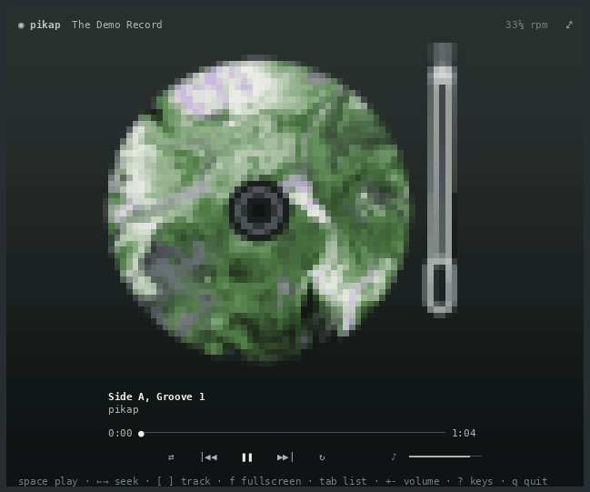

# pikap

<p align="center"></p>

A record player in the terminal, drawn in half blocks, two pixels to a cell,
or in ASCII if you prefer. ("Pikap" is Turkish for a record player.)

```bash
go install github.com/thebanri/limoni/apps/pikap@latest

pikap                 # follow whatever is playing: Spotify, a browser tab, mpv, VLC…
pikap ~/Music         # play files itself
pikap song.flac dir/  # files and folders, in that order
pikap -demo           # the built-in record, needing nothing
pikap -ascii          # ASCII characters instead of half blocks
pikap -vinyl          # a black record with the cover on its label
```

Or download it ready to run, for Linux, macOS or Windows, from the
`pikap_…` files of a [release](https://github.com/thebanri/limoni/releases).
Playing files needs ffmpeg on the computer. Following another player
works on Linux and the BSDs, where players speak MPRIS.

## Following another player

With no files, pikap follows the media playing on the computer through
MPRIS, the desktop's media interface on Linux and the BSDs. It shows the
track's cover on the record, which turns while the music plays and coasts
to a stop when it pauses. The tonearm moves across the record as the song
goes on.

The song can be moved back and forth from the record:

- **drag the record** to scrub, one turn for ten seconds;
- **drag the arm** and let it go to put the needle down anywhere;
- `←` `→` seek 5 seconds, `Shift` with them 30, and the wheel over the
  record 3;
- click or drag the progress bar.

The speed (`1` `3` `4` `7`, `<` `>`) is only how fast the record is shown
turning. It never changes the music or the player.

When several players are open, the one playing is followed. The list on
the right shows them all, and choosing one keeps it followed while it is
paused.

## Playing files

Given files or folders, pikap plays them itself: ffmpeg decodes them
(anything it reads: Opus, FLAC, MP3, AAC, Vorbis, WAV…), and the sound goes
to `pw-play`, `pacat`, `aplay` or sox's `play` on Linux, or to the system
output on macOS and Windows. Tags and lengths come from ffprobe. A cover is
taken from the file, from a `cover.jpg` or `folder.png` beside it, or,
failing both, painted from the album's name.

Then the record *is* the sound. Pausing slows the music down with the
platter, pressing play spins it back up, dragging the record scratches it
(backwards too).
`c` turns off the crackle.

## Keys

| key | |
| :-- | :-- |
| `space` or `K` | play / pause |
| `←` `→`, `H` `L` | seek 5 s (`Shift`: 30 s) |
| `,` `.` | seek 30 s |
| `[` `]`, `P` `N` | previous / next |
| `↑` `↓` `Enter` | choose from the list |
| `Tab` | hide or show the list; drag its left edge to make it wider or narrower |
| `F`, or the `⤢` in the corner | fullscreen: only the record and what plays (`F`, `Esc` or `⤡` goes back) |
| `S` / `R` | shuffle / repeat (off, all, one) |
| `+` `-` | volume |
| `1` `3` `4` `7` | 16⅔, 33⅓, 45, 78 rpm |
| `<` `>`, or the wheel over the speed | 1 rpm slower / faster, from 8⅓ to 83⅓ (the look only) |
| `D` | picture disc / black vinyl |
| `V` | half blocks / ASCII |
| `C` | crackle on or off (files) |
| `?` | every key, on a card (`?` or `Esc` closes it) |
| `Q`, or `Esc` outside fullscreen | quit |

## How it is drawn

The default is half blocks: each cell is a `▀` with two colours, a pixel
above and a pixel below. Every pixel is the average of four samples, so the
record's rim and the arm have soft edges.

With `-ascii` (or `V`), each cell is sampled in six places instead, two
across and three down. Every printable character was measured the same way
at start-up, from a bitmap font, by how much ink it puts in each of the six
parts. A cell gets the character whose ink is shaped most like the picture,
so the rim of the record comes out as `(` and `)` and the tonearm as `/`. A
brightness ramp would give a staircase of `#`.

Either way a frame of a 160×50 terminal costs about a millisecond and a
half (1.4–1.5 ms on a Ryzen 5 5600, `go test -bench Frame`) and allocates
nothing.

## Tests

`go test ./...` covers the platter's physics and the needle, the gestures,
file names, and the MPRIS side against a fake player on a `dbus-daemon`
of the test's own. Three opt-in runs need a person or a desktop:

```bash
PIKAP_PNG=/tmp go test -run TestSnapshotPNG            # frames as PNG files, to look at
PIKAP_SOUND=1 go test -run TestOutputTakesTheStream   # the system's audio output takes the stream
dbus-run-session -- sh -c 'PIKAP_FAKE=1 go test -run TestServeFakePlayer -timeout 0 & sleep 1; go run .'
```
