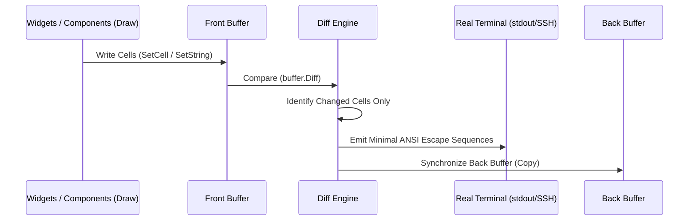

# 🏛️ Architecture and Zero-Allocation Philosophy

Limoni is built from the ground up to solve two fundamental bottlenecks common in traditional TUI libraries (Bubble Tea, Tview, etc.):
1. **Garbage Collector (GC) Overhead & Heap Allocations**: Allocating hundreds of strings, closures, and slices on every frame causes noticeable micro-stuttering and unpredictable GC pauses.
2. **Bandwidth and ANSI Escape Sequence Bloat**: Redrawing the entire terminal frame on every tick incurs high latency, especially over remote sessions (SSH/PTY) or on high-resolution displays.

---

## 1. 1D Contiguous Memory Grid (`1D Flat Slice []cell.Cell`)

Conventional matrix implementations often use `[][]Cell` (slice of slices), requiring separate heap allocations and pointers for each row. This layout causes frequent CPU cache misses (L1/L2) due to scattered memory addresses.

Limoni stores the entire screen buffer as a single, contiguous `[]cell.Cell` array:

```
Memory Layout:
[ (0,0), (1,0), (2,0), ... (W-1,0), (0,1), (1,1), ... (W-1, H-1) ]
```

- **Indexing Formula**: `Index = y * Width + x`
- **CPU Cache Line Efficiency**: Contiguous sequential memory access enables hardware prefetchers to stream cells directly into L1 CPU cache lines with zero indirection.

---

## 2. Cell Structure and Memory Alignment (`cell.Cell`)

Each `cell.Cell` is optimized into an exact 16-byte aligned data structure to minimize memory footprint:

```go
type Cell struct {
    Content rune    // 4 bytes: Unicode code point (UTF-32)
    Style   Style   // 10 bytes: (4 bytes Fg + 4 bytes Bg + 2 bytes Modifier)
                    // + 2 bytes compiler alignment padding = 16 bytes total.
}
```

- A standard terminal window of 120 columns x 40 rows (`4,800 cells`) requires only **76.8 KB** of memory.

---

## 3. Double-Buffered Synchronized ANSI Diff Engine (`buffer.Diff`)

Operating similarly to modern graphics pipelines, Limoni maintains two dedicated buffers:
- **Front Buffer**: The active buffer where widgets and components render during the current frame.
- **Back Buffer**: The snapshot representing the exact physical state currently displayed on the terminal.



### Synchronized Output Protocol (`?2026h`)
Terminals supporting the **Synchronized Output Mode (`\x1b[?2026h`)** protocol (such as Alacritty, Kitty, WezTerm, Ghostty, iTerm2, and Windows Terminal) render frame updates atomically, completely eliminating screen tearing and flickering.

---

## 4. Zero-Allocation Benchmark Evidence

Limoni's rendering hot paths are rigorously benchmarked to verify zero heap allocations per frame:

| Workload | Limoni Latency | Memory / Op | Allocations / Op |
| :--- | :--- | :--- | :--- |
| **Empty Frame** | `11.5 ns/op` | **`0 B/op`** | **`0 allocs/op`** |
| **Text-Heavy Frame** | `4.8 µs/op` | **`0 B/op`** | **`0 allocs/op`** |
| **10,000-Row Virtual Table** | `41.2 µs/op` | **`0 B/op`** | **`0 allocs/op`** |
| **100-Layer Z-Index Modal Stack** | `40.1 ns/op` | **`0 B/op`** | **`0 allocs/op`** |
| **Mouse Hit-Testing** | `63.5 ns/op` | **`0 B/op`** | **`0 allocs/op`** |
| **Async Update Burst (1000 Events)** | `204.0 ns/op` | **`0 B/op`** | **`0 allocs/op`** |

---

## 5. Allocation-Free Interactive Frames

The widget benchmarks call `Draw` directly. A real frame also registers what
clicks and the mouse wheel do, and that is where allocations used to hide: a
closure built during `Draw` is a heap allocation, every widget, every frame.
`BenchmarkInteractiveFrame` in `benchmarks/` draws a checkbox, a text input,
a list and a block through a real `Terminal` with a theme set. It measured 19
allocations and 816 B per frame, and now measures zero. CI keeps it there.

Two things make that possible, and your own widgets should follow them.

**Register actions as data, not closures.** `cell.ClickAction` covers the
common cases: focus a widget, toggle a `*bool`, set an `*int`. The frame copies
it, so nothing is allocated:

```go
func (w MyToggle) Draw(ctx cell.Context, buf *buffer.Buffer) {
	if ctx.RegisterClickAction != nil {
		ctx.RegisterClickAction(ctx.Area, cell.ClickAction{Focus: w.ID, Toggle: w.On})
	}
	// ... draw
}
```

`ctx.RegisterScroll(area, &state.Offset, max)` does the same for the mouse
wheel. `ctx.RegisterClick(area, func() {...})` still works for anything else,
at the cost of one allocation per frame.

**Where it stands.** Checkbox, Radio, TextInput, TextArea, List, Paragraph,
RichText, Markdown (focus), Progress, Sparkline and Image register actions.
Tabs, Viewport and Markdown scrolling, Table, TreeView, Select, Popup, Dialog,
Slider, Scrollbar, ColorPicker, CommandPalette, Toast, VirtualDataView,
Viewer3D and `component`'s interactive modifiers still register closures,
because they drag, call application callbacks, or handle several buttons. Each
of those costs one allocation per frame until it is converted.

**Hold widgets by pointer.** `f.RenderWidget(widgets.Checkbox{...}, area)`
converts a struct value to the `Widget` interface, and a struct larger than a
pointer is copied to the heap to do that. Build the widget once and pass
`&checkbox` (or keep a `*widgets.Checkbox`) and the conversion is free.

---

## 6. Unicode East Asian Width & Hardware Cursor Sync

Emojis (`🔴`, `🚀`, `☕`) and fullwidth characters take up 2 terminal columns, while narrow glyphs take 1 column. Incorrect width calculations can misalign the hardware cursor and shift vertical borders (`│`):

- **Strict EAW Standard**: Character width resolution adheres to the Unicode East Asian Width (`W`/`F`) specification.
- **Continuation Cell Protection (`RuneContinuation`)**: The right half of fullwidth characters is tagged with a `RuneContinuation` marker.
- **Modal Overlap Protection**: When floating windows or dialogs move across fullwidth characters, orphan continuation cells are safely cleared. The diff engine forces full redraw of bisected characters, preventing ghost border artifacts.

---

## 7. Engine Safety & Deterministic Command Dispatch

- **Deterministic Ordering**: `Cmd` commands execute asynchronously across worker goroutines, but their results are buffered and delivered to `Update` in strict dispatch sequence order.
- **Strict Cancellation Precedence**: When context cancellation (`ctx.Done()`) or shutdown occurs, pending command results and queued messages are immediately discarded, preventing state mutation after termination.
- **Panic Isolation**: Panics in user commands or models are intercepted via `WithPanicHandler`, keeping the host application resilient.

---

## 8. Unified Root Facade (`github.com/thebanri/limoni`)

To eliminate complex nested package imports for everyday development, core primitives, widget builders, layout engines, and runtime launchers are re-exported through the root `package limoni`.
