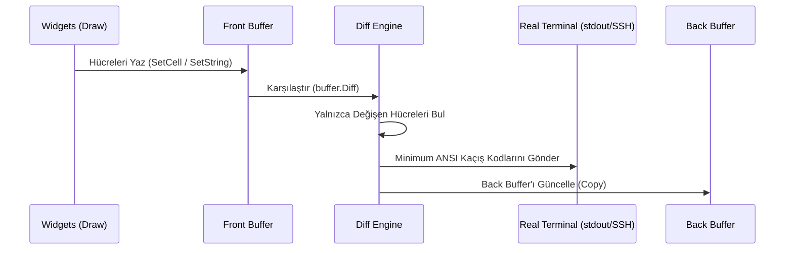

# 🏛️ Mimari ve Sıfır-Tahsisat Felsefesi (Architecture)

Limoni, piyasadaki geleneksel TUI kütüphanelerinin (Bubble Tea, Tview vb.) karşılaştığı iki temel darboğazı çözmek üzere sıfırdan tasarlanmıştır:
1. **Garbage Collector (GC) Yükü ve Bellek Tahsisatı**: Her render karesinde yüzlerce string ve slice tahsis edilmesi terminalde mikro takılmalara yol açar.
2. **Bant Genişliği ve ANSI Kaçış Kodu Şişkinliği**: Tüm ekranı her karede baştan çizmek, uzaktan (SSH/PTY) veya yüksek çözünürlüklü terminallerde yüksek gecikme yaratır.

---

## 1. 1D Düz Bellek Izgarası (`1D Flat Slice []cell.Cell`)

Geleneksel matris yaklaşımları `[][]Cell` (slice of slices) kullanarak her satır için ayrı bir pointer ve heap tahsisi gerektirir. Bu durum CPU önbelleğinde (L1/L2 Cache) sürekli **Cache Miss** yaratır.

Limoni, tüm ekranı ardışık ve düz bir `[]cell.Cell` dizisi olarak saklar:

```
Bellek Düzeni:
[ (0,0), (1,0), (2,0), ... (W-1,0), (0,1), (1,1), ... (W-1, H-1) ]
```

- **İndeksleme Formülü**: `Index = y * Width + x`
- **CPU Verimliliği**: Ardışık bellek erişimi sayesinde CPU donanımsal önceden yükleyicisi (Hardware Prefetcher) hücreleri doğrudan L1 önbelleğine aktarır.

---

## 2. Hücre Yapısı ve Bellek Hizalaması (`cell.Cell`)

Her bir hücre (`cell.Cell`), bellek ayak izini minimumda tutmak için 16 baytlık optimize bir veri yapısına sahiptir:

```go
type Cell struct {
    Content rune    // 4 bayt: Unicode karakter (UTF-32)
    Style   Style   // 10 bayt: (4 bayt Fg + 4 bayt Bg + 2 bayt Modifier)
                    // + 2 bayt Go derleyici hizalaması (Alignment padding) = Toplam 16 bayt.
}
```

- 120 sütun x 40 satırlık standart bir terminal penceresi (`4,800 hücre`) bellekte yalnızca **76.8 KB** yer kaplar.

---

## 3. Çift Tamponlu Senkronize ANSI Diff Motoru (`buffer.Diff`)

Limoni, grafik kartlarının çalışma mantığına benzer şekilde iki tampon tutar:
- **Front Buffer**: Mevcut karede widget'ların üzerine çizim yaptığı aktif tampon.
- **Back Buffer**: Terminal ekranında o an fiziksel olarak çizili duran tampon.



### Senkronize Ekran Yenileme (`?2026h`)
Modern terminallerin (Alacritty, Kitty, WezTerm, Ghostty, iTerm2, Windows Terminal) desteklediği **Synchronized Output Mode (`\x1b[?2026h`)** protokolü sayesinde ekranda hiçbir yırtılma (tearing) veya titreme (flicker) yaşanmaz.

---

## 4. Sıfır-Tahsisat (Zero-Alloc) Benchmark İspatı

Limoni'nin render sıcak yolunda (Hot Path) bellek tahsisatı yapmadığı mikrosaniye düzeyinde doğrulanmıştır:

| İş Yükü | Limoni Gecikmesi | Bellek / İşlem | Tahsisat / İşlem |
| :--- | :--- | :--- | :--- |
| **Boş Çerçeve (Empty Frame)** | `11.5 ns/op` | **`0 B/op`** | **`0 allocs/op`** |
| **Metin Ağırlıklı Çerçeve (Text Frame)** | `4.8 µs/op` | **`0 B/op`** | **`0 allocs/op`** |
| **10.000 Satırlı Sanal Tablo** | `41.2 µs/op` | **`0 B/op`** | **`0 allocs/op`** |
| **100 Katmanlı Z-Index Modal Derinliği** | `40.1 ns/op` | **`0 B/op`** | **`0 allocs/op`** |
| **Fare Tıklama & Hit-Testing** | `99.2 ns/op` | **`0 B/op`** | **`0 allocs/op`** |
| **Asenkron Update Burst (1000 Event)** | `204.0 ns/op` | **`0 B/op`** | **`0 allocs/op`** |
