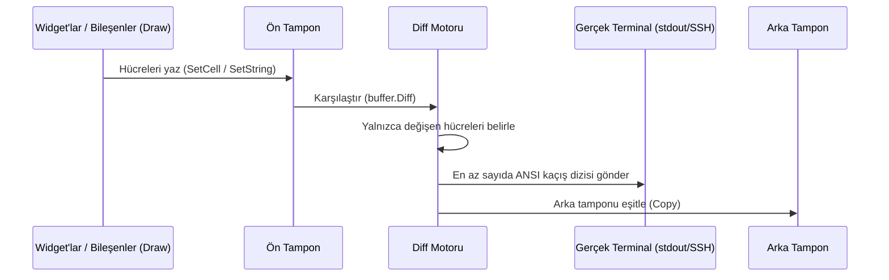

# 🏛️ Mimari ve Sıfır Tahsisat Felsefesi

Limoni, geleneksel TUI kütüphanelerinde (Bubble Tea, Tview vb.) sık görülen iki temel darboğazı çözmek üzere tasarlandı:

1. **Çöp toplayıcı (GC) yükü ve heap tahsisatları:** Her karede yüzlerce string, closure ve slice oluşturmak gözle görülür mikro takılmalara ve öngörülemeyen GC duraklamalarına yol açabilir.
2. **Bant genişliği ve ANSI kaçış dizilerinin fazlalığı:** Her yenilemede terminal karesinin tamamını yeniden çizmek, özellikle SSH/PTY gibi uzak oturumlarda veya yüksek çözünürlüklü ekranlarda gecikmeyi artırır.

---

## 1. Tek boyutlu bitişik bellek ızgarası (`[]cell.Cell` düz slice)

Geleneksel `[][]Cell` (slice'ların slice'ı) matrisleri, her satır için ayrı heap tahsisatı ve işaretçiler gerektirir. Bellek adreslerinin dağınık olması CPU önbelleğinde (L1/L2) sık kaçırmalara neden olabilir.

Limoni, ekran tamponunun tamamını bitişik tek bir `[]cell.Cell` dizisinde saklar:

```
Bellek düzeni:
[ (0,0), (1,0), (2,0), ... (W-1,0), (0,1), (1,1), ... (W-1, H-1) ]
```

- **İndeks formülü:** `Index = y * Width + x`
- **CPU önbellek satırı verimliliği:** Ardışık bellek erişimi, donanımın hücreleri araya dolaylı erişim girmeden doğrudan L1 önbellek satırlarına taşımasını sağlar.

---

## 2. Hücre yapısı ve bellek hizalaması (`cell.Cell`)

Bellek kullanımını azaltmak için her `cell.Cell`, tam 16 baytlık hizalı bir yapı olarak düzenlenmiştir:

```go
type Cell struct {
    Content rune    // 4 bayt: Unicode kod noktası (UTF-32)
    Style   Style   // 10 bayt: (4 bayt Fg + 4 bayt Bg + 2 bayt Modifier)
                    // + 2 bayt derleyici hizalama dolgusu = toplam 16 bayt.
}
```

- 120 sütun × 40 satırlık standart bir terminal penceresi (`4.800 hücre`) yalnızca **76,8 KB** bellek kullanır.

---

## 3. Çift tamponlu, eşzamanlı ANSI diff motoru (`buffer.Diff`)

Modern grafik ardışık düzenlerine benzer biçimde Limoni iki ayrı tampon tutar:

- **Ön tampon (Front Buffer):** Widget'ların ve bileşenlerin geçerli kareyi çizdiği etkin tampon.
- **Arka tampon (Back Buffer):** Terminalde o anda görünen fiziksel durumu temsil eden anlık görüntü.



### Eşzamanlı çıktı protokolü (`?2026h`)

**Eşzamanlı Çıktı Modu (`\x1b[?2026h`)** protokolünü destekleyen terminaller (Alacritty, Kitty, WezTerm, Ghostty, iTerm2 ve Windows Terminal gibi) kare güncellemelerini atomik olarak işler; böylece ekran yırtılması ve titreme önlenir.

---

## 4. Sıfır tahsisatlı benchmark kanıtları

Limoni'nin çizim yolundaki performans-kritik bölümleri, kare başına heap tahsisatı olmadığını doğrulamak için düzenli olarak benchmark edilir:

| İş yükü | Limoni gecikmesi | Bellek / işlem | Tahsisat / işlem |
| :--- | :--- | :--- | :--- |
| **Boş kare** | `11.5 ns/op` | **`0 B/op`** | **`0 allocs/op`** |
| **Yoğun metin karesi** | `4.8 µs/op` | **`0 B/op`** | **`0 allocs/op`** |
| **10.000 satırlı sanal tablo** | `41.2 µs/op` | **`0 B/op`** | **`0 allocs/op`** |
| **100 katmanlı Z-Index modal yığını** | `40.1 ns/op` | **`0 B/op`** | **`0 allocs/op`** |
| **Fare çarpışma testi** | `63.5 ns/op` | **`0 B/op`** | **`0 allocs/op`** |
| **Eşzamansız güncelleme patlaması (1000 olay)** | `204.0 ns/op` | **`0 B/op`** | **`0 allocs/op`** |

---

## 5. Tahsisatsız etkileşimli kareler

Widget benchmark'ları `Draw`'ı doğrudan çağırır. Gerçek bir kare ise tıklamanın
ve fare tekerleğinin ne yapacağını da kaydeder; tahsisatların saklandığı yer
tam olarak burasıydı: `Draw` sırasında kurulan bir closure, her widget için,
her karede bir heap tahsisatıdır. `benchmarks/` içindeki
`BenchmarkInteractiveFrame`, teması ayarlanmış gerçek bir `Terminal` üzerinden
bir checkbox, bir metin girdisi, bir liste ve bir blok çizer. Kare başına 19
tahsisat ve 816 B ölçüyordu; şimdi sıfır ölçüyor. CI bunu böyle tutuyor.

Bunu mümkün kılan iki kural var ve kendi widget'larınız da bunlara uymalı.

**Eylemleri closure olarak değil, veri olarak kaydedin.** `cell.ClickAction`
yaygın durumları karşılar: bir widget'a odaklanmak, bir `*bool` değerini
değiştirmek, bir `*int` atamak. Kare bunu kopyaladığı için hiçbir şey tahsis
edilmez:

```go
func (w MyToggle) Draw(ctx cell.Context, buf *buffer.Buffer) {
	if ctx.RegisterClickAction != nil {
		ctx.RegisterClickAction(ctx.Area, cell.ClickAction{Focus: w.ID, Toggle: w.On})
	}
	// ... çizim
}
```

`ctx.RegisterScroll(area, &state.Offset, max)` aynı şeyi fare tekerleği için
yapar. `ctx.RegisterClick(area, func() {...})` geri kalan her şey için hâlâ
çalışır; bedeli kare başına bir tahsisattır.

**Durum ne?** Checkbox, Radio, TextInput, TextArea, List, Paragraph, RichText,
Markdown (odak), Progress, Sparkline ve Image eylem kaydeder. Tabs, Viewport ve
Markdown kaydırması, Table, TreeView, Select, Popup, Dialog, Slider, Scrollbar,
ColorPicker, CommandPalette, Toast, VirtualDataView, Viewer3D ve `component`
paketinin etkileşimli düzenleyicileri hâlâ closure kaydeder; çünkü sürükleme
yaparlar, uygulama geri çağrılarını çağırırlar ya da birden çok fare tuşunu
işlerler. Bunların her biri dönüştürülene kadar kare başına bir tahsisata mal
olur.

**Widget'ları işaretçiyle tutun.** `f.RenderWidget(widgets.Checkbox{...}, area)`
bir struct değerini `Widget` arayüzüne dönüştürür ve bir işaretçiden büyük olan
struct bunun için heap'e kopyalanır. Widget'ı bir kez kurup `&checkbox` geçin
(ya da bir `*widgets.Checkbox` saklayın); dönüşüm bedava olur.

---

## 6. Unicode Doğu Asya genişliği ve donanım imleci eşitlemesi

Emojiler (`🔴`, `🚀`, `☕`) ve tam genişlikli karakterler terminalde 2 sütun kaplarken dar karakterler 1 sütun kaplar. Genişlik yanlış hesaplanırsa donanım imleci kayabilir ve dikey kenarlıklar (`│`) hizasını yitirebilir:

- **Kesin EAW standardı:** Karakter genişliği, Unicode Doğu Asya Genişliği (`W`/`F`) belirtimine göre belirlenir.
- **Devam hücresi koruması (`RuneContinuation`):** Tam genişlikli karakterin sağ yarısı `RuneContinuation` işaretçisiyle etiketlenir.
- **Modal çakışma koruması:** Kayan pencere veya iletişim kutuları tam genişlikli karakterlerin üzerine taşındığında, eşleşmeyen devam hücreleri güvenle temizlenir. Diff motoru ikiye bölünmüş karakterleri baştan çizer; böylece hayalet kenarlık izleri önlenir.

---

## 7. Motor güvenliği ve belirlenimci komut dağıtımı

- **Belirlenimci sıralama:** `Cmd` komutları worker goroutine'lerinde eşzamansız çalışır; ancak sonuçları tamponlanır ve `Update` fonksiyonuna kesin dağıtım sırasıyla iletilir.
- **İptal önceliği:** Bağlam (`ctx.Done()`) iptal edildiğinde veya kapatma başladığında bekleyen komut sonuçları ve kuyruktaki iletiler hemen atılır. Böylece sonlandırma sonrasında durum değişikliği yapılmaz.
- **Panic yalıtımı:** Kullanıcı komutlarındaki veya modellerindeki panic durumları `WithPanicHandler` ile yakalanır; ana uygulamanın çalışmaya devam etmesi sağlanır.

---

## 8. Birleşik kök facade (`github.com/thebanri/limoni`)

Günlük geliştirmede iç içe paketlerden import etme karmaşasını azaltmak için temel öğeler, widget oluşturucular, yerleşim motorları ve çalışma zamanı başlatıcıları kök `package limoni` üzerinden yeniden dışa aktarılır.
